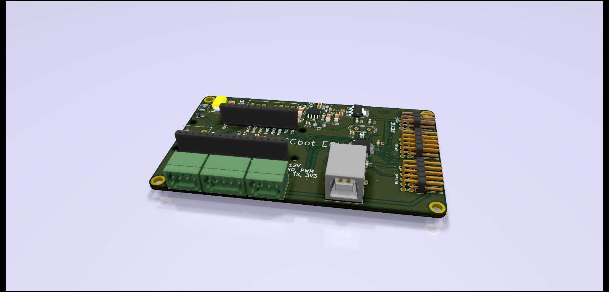
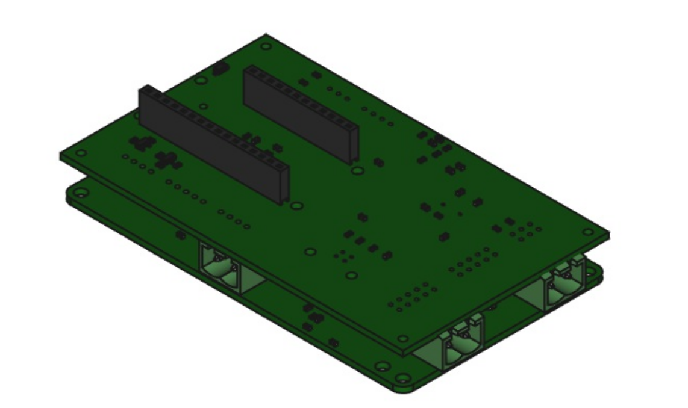
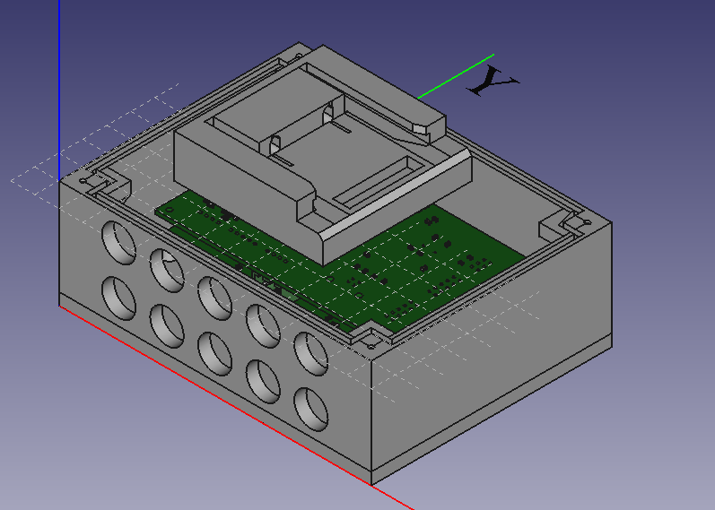
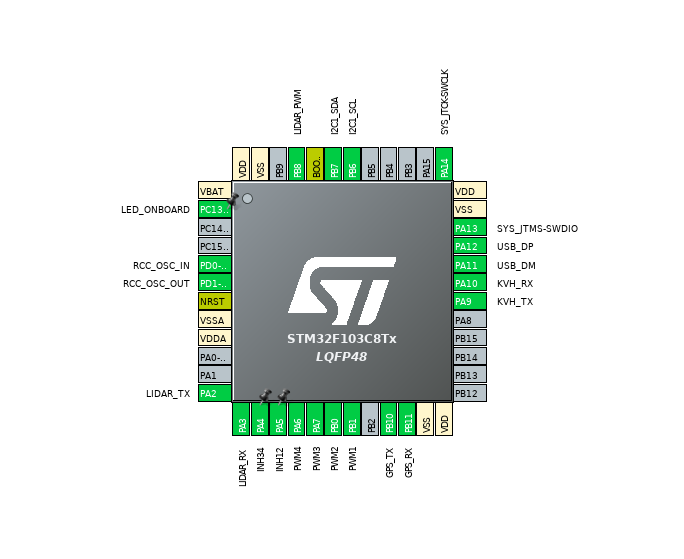

# JECCbotECU

This Repository contains everything about controlling the JECCbot mini ( https://github.com/generationmake/JECCbot_mini ) with a the JECCbotECU board. There is also included software with web frontend for a Raspberry Pi, to move the robot to GPS waypoints.

## Hardware

### PCB

The JECCbotECU is formed from the controller board ( data included in this repository ) and some motor driver stage ( tested with https://github.com/generationmake/HighPowerMotorFeatherWing/ ). The controller pcb in this repository features a Bosch BNO055 IMU, the connection of a KVH C100 compass unit, GPS and RPLidar, USB VCOMM, different voltage regulators, GPIO port and SW-Debugging.





### Case

There is also a case for the ECU unit with HighpowerMotorFeatherwing in this repository. It's size is 12cm x 10cm and it is fully compatible with the mountingholes on the JECCbot mini. On the top of the case, there is a snap in holder for a Einhell PowerXChange 18V drill battery.



## Software

### ECU 
 
The ECU Software is written in C using the STM32 Cube HAL hardware abstraction layer. It currently features control of two dc motors, emergency stop, rplidar, gps and compass decoding and driving the robot along a heading to north.

Here You can see the configured pinout of the STM32F103C8T6 mikrocontroller, which is compatible to STM32 Bluepill evalboard:



#### Computer interaction

The ECU can be interact with computer by using USB and a state based api.

##### Description of implemented states

###### State 0 - Joydrive

The direction and speed of the motors can be manipulated with the registers ```PWM_LEFT``` and ```PWM_RIGHT```. The value ranges are int16.

###### State 1 - Drive along compass heading

The robot can drive along a heading from -180° to 180° saved in the ```MOVEHEADING_HEADING``` register with a int16 speed in ```MOVEHEADING_SPEED``` by using a P-Controller with the parameter register ```MOVEHEADING_P```.

#### Protocol

The protocol is leaned on ASCII-Modbus and is register based. 

Every protocol instruction message begins with ```:```, which is followed with a 8 bit instructor. Then there is a 16 bit hex register address and a 16 bit or 32 bit hex register value ( interpreted as signed int ). Every message ends with ```\n```: 

```:<02/ 04><hex address><hex value>\n```

The mikrocontroller answers with ```:```, the register, value and ```\n```;

###### Protocol Configuration

```
API_MEMORY_SIZE 400

API_STATE_JOYDRIVE 0x0000
API_STATE_MOVEHEADING 0x0001

API_INSTRUCTION_READ 0x02
API_INSTRUCTION_WRITE 0x04

API_ERROR_WRONG_FORMAT 0x0000
API_ERROR_INVALID_ADDRESS 0x0001
API_ERROR_WRONG_INSTRUCTOR 0x0002
API_ERROR_ACCESS_DENIED 0x0003

API_REG_STATE 0x0000

API_REG_PWMLEFT 0x0002
API_REG_PWMRIGHT 0x0004

API_REG_MOVEHEADING_P 0x0005
API_REG_MOVEHEADING_SPEED 0x0006
API_REG_MOVEHEADING_HEADING 0x0007

API_BENCH_LIDAR_START 0x000f
API_BENCH_LIDAR_END API_BENCH_LIDAR_START + 360

API_REG_HEADING_KVH 0x0178

API_BENCH_GPS_START 0x0179
API_BENCH_GPS_END API_BENCH_GPS_START + 5
```

###### Example

Set robot state to 1:

Instruction: ```:04000000001\n``` -> Response ```:00000001\n```.


###### Error Codes

Every error code starts with the command e and has a specific index ( %03d ) as parameter, e. g. ```:e001\n```.

| Index | Meaning |
| ----- | ------- |
| 000 | received data is no command |
| 001 | Command is not found |
| 002 | Syntax error in command |

#### KVH Terminal

There is also a program included that lets the ECU act as a terminal to a connected KVH C100 compass unit. This can be used for calibrating the compass.

### Raspberry Pi

The main sotware used in the demonstration for Istrobot 2020 ( https://www.youtube.com/watch?v=Fceis1Gl848 ) is also included as a Codeblocks project.
In the html folder You can find the frontend design with commands to the robot via HTML POST.
